# Designing MEG headcasts

This document outlines the procedure as designed by Robert in 2021. It has been superseded by another procedure following the pilots of Bob and Uriel. Please ask Miranda or Jan-Mathijs for up-to-date details.

## Summary of the procedure, shared code and models

The procedure for designing the initial 3D model of the scalp surface and aligning it
with the coordinate system and the head localizer coils is implemented in `do_make_headcast.m`.

To set up the MATLAB path, you can use `do_startup.m`.

The 3D model of the scalp surface is exported to MeshMixer, together with the dewar and a
number of auxiliary shapes (coils, binoculars, earflaps). In MeshMixer these are put together
and the dewar is "subtracted from the scalp model. The resulting model can be 3D printed.

The 3D printed "positive" model is placed in the dewar. Polyurethane foam resin is poured between
the model and the dewar to fill the gap, thereby creating the "negative" head cast.

The `prepare_xxx.m` files are only included for reference, these were used to create
the `.mat` models that are included here.

## Background

Precisely fitting headcasts can ensure that a subject is positioned in the MEG such that he/she cannot move in long experiments, and that the subject can be repositioned in exactly the same way in subsequent sessions. Making a headcast takes time and money.

People with (varying levels of) experience at the DCCN:

- Tom Marshall
- Kristijan Armeni
- Jan-Mathijs Schoffelen
- Bob Bramson

Relevant literature and links:

- Meyer, Barnes et al. Flexible head-casts for high spatial precision MEG. J Neurosci Methods, 2017. Jan 30;276:38-45. doi: 10.1016/j.jneumeth.2016.11.009
- Chella, Barnes, Pizzella et al. The impact of improved MEG-MRI co-registration on MEG connectivity analysis. Neuroimage. 2019 Aug 15;197:354-367. doi: 10.1016/j.neuroimage.2019.04.061

## Procedure

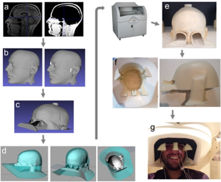

The procedure that is described here can be outlined as follows:

- a) Head surface is extracted from an anatomical MRI image using the standard SPM12 segmentation procedure.
- b) Head surface extraction is converted to a surface file and fiducial coils are added. The coil locations are defined in MRI coordinates.
- c) A positioning cylinder at the top of the head is added to the virtual model to define the position of the head inside the head-cast. Eye extensions are added to enable vision during use.
- d) Using and adjusting the positioning cylinder, eye extensions and ear extensions, the virtual head model is positioned appropriately inside a virtual copy of the MEG dewar.
- e) The positive head model is 3D printed.
- f) The 3D print is placed inside the manufacturer-provided dewar copy (as in d) and foam resin is poured in to fill the gap between the printed positive head model and the dewar. The fiducial coil protrusions on the 3D printed head result in coil-shaped and coil-sized indentations in the head-cast (the nasion coil protrusion is visible between the eyes in e).
- g) The subject can now wear the flexible foam head-cast and enter into the (real) MEG dewar for scanning.

## Making the anatomical MRI

A specific MRI sequence is needed to minimize the distortion at the interface between skin and air. Jan-Mathijs figured out the details with Jose. Our scanners have a sequence according to the FIL specifications, and a better one (according to Jose). Jan-Mathijs compared them with Kris, and they don't appear to differ significantly. In Kris' experiments they used the FIL sequence.

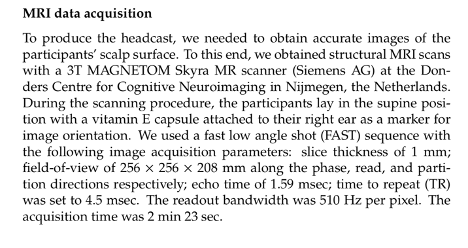

Complete coverage is important, even more so that with a normal anatomical MRI for MEG purposes.

Hair is not visible on the MRI. The ears in the segmented MRI might be too flat to the head, hence the ears need some additional space in the model.

## Creating the 3D model element

The inital MATLAB code from Jan-Mathijs was shared with Bob. I started with the code of Jan-Mathijs, and especially improved on the coregistration and modeling the cut-outs for eyes and ears.

The first phase is implemented in MATLAB and consists of

- importing the DICOM images
- doing a coarse alignment of the MRI to the CTF coordinate system
- segment the head surface
- construct the head surface

The second phase is implemented in MATLAB and consists of

- load the geometrical model of the axes (+x, +y , -y)
- shift the head surface so that it is nicely aligned relative to the axes
- apply the transformation from step 6 also to the anatomical MRI
- export the aligned head surface

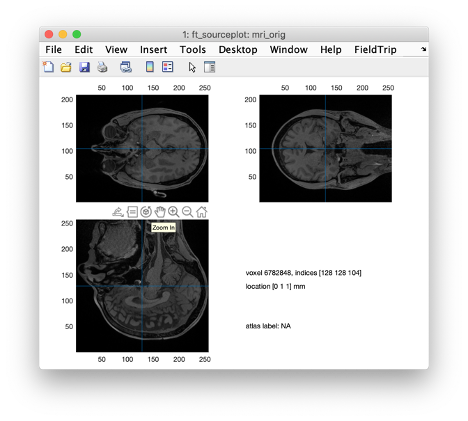
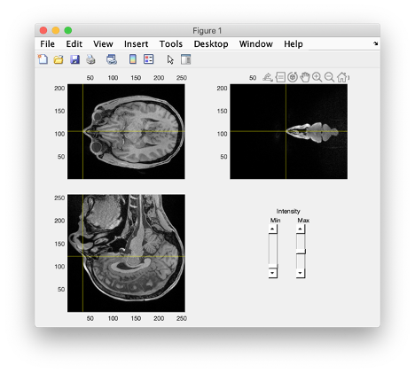
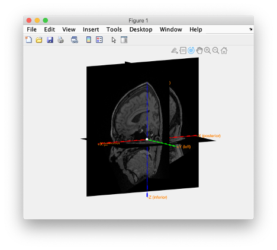
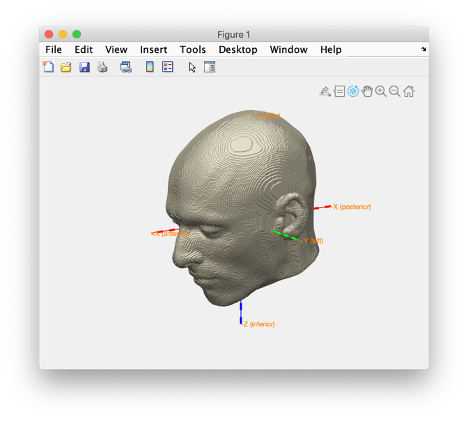
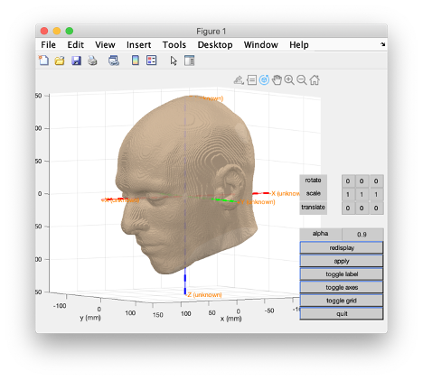
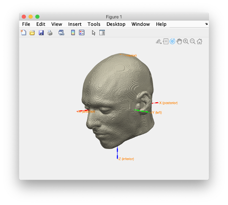
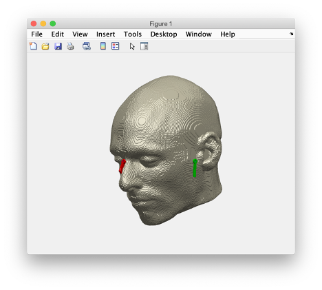
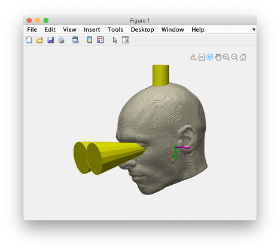

This process results in

- dewar.stl
- earcanal_left.stl
- earcanal_right.stl
- earflap_left.stl
- earflap_right.stl

Which all need to be aligned to the following

- scalp_coreg3.stl
- combined_axes.stl
- headcoil_lpa_coreg3.stl
- headcoil_nas_coreg3.stl
- headcoil_rpa_coreg3.stl
- binoculars.stl
- vertex_cylinder.stl

The scalp and head coils are all aligned to the axes and should not be moved relative to each other, but - if needed - the binoculars and vertex cylinder can be moved for a better fit.

## Positioning the head relative to the helmet (or vice versa)

1. Load all model components in MeshMixer.
2. Check the alignment of the scalp and head coils relative to combined axes, then discard the axes.
3. Hide the ear flaps and canals from view.
4. Move the dewar to the desired position relative to the head.
5. Move the ear flaps to the right position, keep them together (i.e. select them both) when you rotate and translate them, only start moving them separately when you move in and out to have them intersect at the right depth with the head.
6. When you move the ear flaps (together, or separate on left and right), you should keep the ear canals selected as well: you want their surfaces to stay aligned. Only when the flaps are in place, you select the left and right canal and rotate/translate them so that the ear canal spans the whole ear to the top.
7. Optionally: move the binoculars and vertex cylinder.
8. Save the intermediate model to a .mix file.
9. Select the binoculars and cut it with a plane, removing the front of the binoculars. Add a cube, and scale/translate/rotate that so that it forms a slab or a plate to close the front of the dewar. This should prevent the resin from pouring out.
10. Combine the scalp, head coils, ear flaps, ear canals, and front plate in one object. Make that object solid.
11. Select the solid combined model and cut it with a plane, removing everything that sticks out underneath the dewar.
12. Select the dewar and make it solid. Make a copy of it, you will need it later.
13. Select the solid model and the solid dewar, then do boolean difference. Use intersection curves.
14. Select the solid model and do separate shells. This will convert it into multiple objects. Keep the large part that is inside the dewar and delete all other small marts (e.g. the top part of the cylinder that sticks out, and the outer parts of the ear flaps).
15. Save the final model to another .mix file.
16. Export the solid model to an STL file, note: do not press Ctrl-S but do “save as” to prevent overwriting the intermediate model, you may want to return to that model.
17. Optionally export the copy of the solid dewar, this will help in later visualisation

Tilt the neck so that the subject is in a comfortable position. At this moment it is also important to think of the position of the head in the dewar; some studies might have more interest in the frontal parts of the brain, or in the occipital parts, and hence might want to try to get those specifically closer to the helmet.

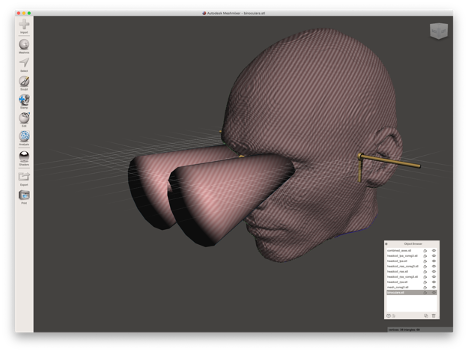
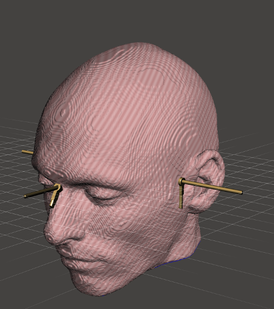

The third phase is implemented in MeshMixer and consists of

- load the geometrical model of the aligned head surface
- load the geometrical model of the axes (+x, +y , -y)
- load the geometrical model of the LPA, RPA and NAS head localizer coils
- move the head localizer coils along the axes to the scalp surface
- load the geometrical model of the "binoculars"
- if needed move the binoculars to match the subjects eye position and gaze direction
- load the geometrical model of the vertex cylinder
- if needed move the vertex cylinder
- remove the geometrical model of the axes
- merge the head surface, coils, cylinder and binoculars in a single surface
- load the model of the dewar
- move the dewar so that the head is properly positioned, paying attention to the gaze direction
- crop the aggregate head model to remove everything that is outside the dewar
- crop the aggregate head model to remove the neck and lower head

The fourth phase is implemented in MeshMixer and consists of

- make the aggregate head model hollow
- export the aggregate head model to an STL file to get it printed

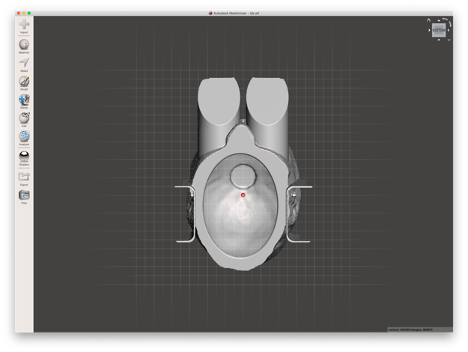
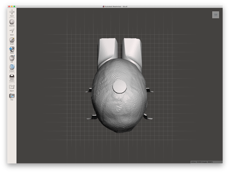
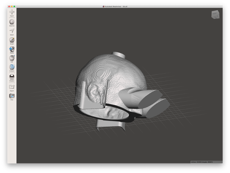

After the 3D model has been written to STL format, it can be sliced and printed. Printing can done with FDM (Fused Deposition Modeling) using a filament, or using SLS with a powder and a laser.

The first model I finished fits on the print bed of a Prusa i3 mk2s printer, see screenshot. Estimated printing time is approximately 69 hours, requires appropriately 250 meter filament (including all supports), which costs about 15 euro.

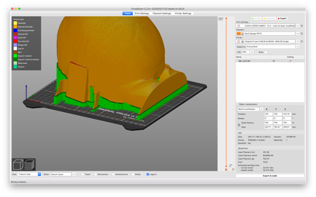

## Making and pouring the foam

We have a fiberglass dummy helmet from CTF at our deposition, and a 3D printed version of that helmet. Pouring the foam in a mid-seperable 3D-printed model of the helmet makes it earier to remove the two pieces that together form the outer shell.

The inside of the helmet needs to be waxed prior to pouring the foam, to ensure that the foam does not stick.

## Safety precautions

As discussed with Gareth: _"Our primary safety measure is therefore to ensure that neither the chair nor the dewar is moved while the subject is wearing a head-cast"_.

See also http://megcommunity.org/instrumentation/peripherals/20-peripheralscategory/31-miscellaneous and especially https://www.youtube.com/watch?v=tVozndvAgyw+

To be discussed: is extra (formal) training and certification needed?

## Maintenande of the headcasts and short-term storage

This is to be done by the researcher.

## Long term storage of the headcasts and the 3D models

The lockers in the MEG lab are not the right place for this. Uriel ordered 3 plastic containers, Robert prepared a A4 paper template for each of the three containers (Marshall, Armeni, Bramson) to document the details of the casts that are stored in each container. This shoul dmake it possible to keep the provenance, and where possible to reinvite participants that already have a headcast for future studies.
