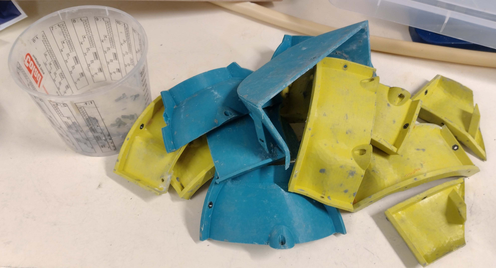
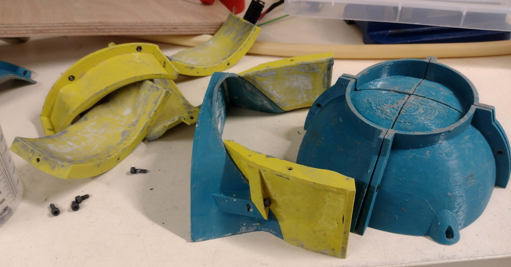
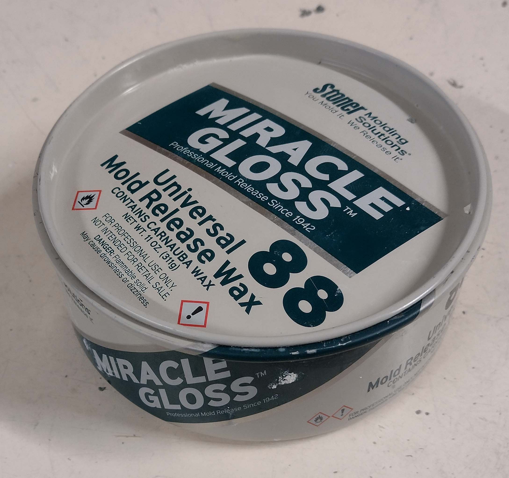

# Making and using MEG headcasts

Precisely fitting headcasts that fill the gap between the participant's head and the inside of the MEG dewar can ensure that a subject is positioned in the MEG such that he/she cannot move in long experiments, and that the subject can be repositioned in exactly the same way in subsequent sessions. Making a headcast takes time and money.

Relevant literature and links:

- Meyer, Barnes et al. Flexible head-casts for high spatial precision MEG. J Neurosci Methods, 2017. Jan 30;276:38-45. doi: 10.1016/j.jneumeth.2016.11.009
- Chella, Barnes, Pizzella et al. The impact of improved MEG-MRI co-registration on MEG connectivity analysis. Neuroimage. 2019 Aug 15;197:354-367. doi: 10.1016/j.neuroimage.2019.04.061

People with (varying levels of) experience at the DCCN:

- Tom Marshall (currently at Oxford)
- Kristijan Armeni (currently at Johns Hopkins)
- Jan-Mathijs Schoffelen
- Bob Bramson
- Felix Klaassen

## Designing the headcasts

This repository contains code, 3D models, and documentation that was compiled over the years at the Donders Centre for Cognitive Neuroimaging (DCCN) at the Donders Institute, Radboud University Nijmegen, NL.

The [design_v1](design_v1) directory represents the procedure as designed by Robert in 2021. It has been superseded by a the [design_v2](design_v2) procedure following the pilots of Bob and Uriel. Please ask Miranda or Jan-Mathijs for up-to-date details.

## 3D printing the head and pouring the foam

In the most recent procedure for pouring the foam we use a 3D printed mold of the dewar that can be disassembled into different pieces. The 3D printed head can be attached to this mold with screws to keep it fixated during the pouring process. The inside of the mold and the outside of the head need to be pre-treated with wax to prevent the foam from sticking too much.

## Safety precautions

TWe should take extra care with the participants' safety when performing MEG experiments with the headcast in place. Since the participants may be highly immobilized, once positioned, it is very important **NOT** to move the chair! Or to quote Gareth: _"Our primary safety measure is therefore to ensure that neither the chair nor the dewar is moved while the subject is wearing a head-cast"_.

See also <https://www.youtube.com/watch?v=tVozndvAgyw+>

For researchers within the DCCN, please consult the standard operating procedure (SOP), which is included in this repository for reference. When using headcasts in the MEG lab of the DCCN, **always check for the latest version** of the SOP on the [DCCN intranet](https://intranet.donders.ru.nl/index.php?id=meg-lab-procedures).

- [standard operating procedure (DCCN)](labinstructions_dccn/SOP_headcast_20220818.pdf)

Researchers from outside the DCCN might also be interested in the lab procedures that are in use in the MEG lab at the UCL, which Gareth Barnes was so kind to share:

- [standard operating procedure (UCL)](labinstructions_ucl/WTCN_MEG_HEADCAST_SOP_march2015.pdf)
- [emergency procedure](labinstructions_ucl/WTCN_MEG_HEADCAST_Emerg_proc_Appendix2.pdf)
- [training checklist](labinstructions_ucl/WTCN_MEG_HEADCAST_training_Appendix1.pdf)
- [volunteer guide](labinstructions_ucl/volunteerguide_v2.pdf)
