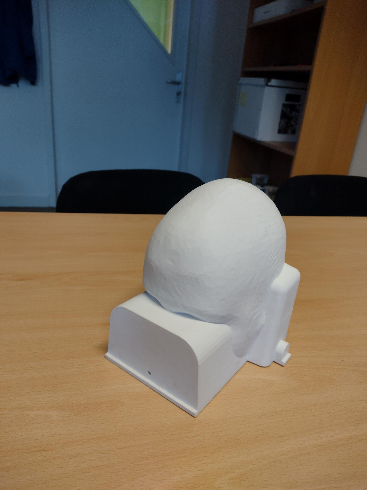
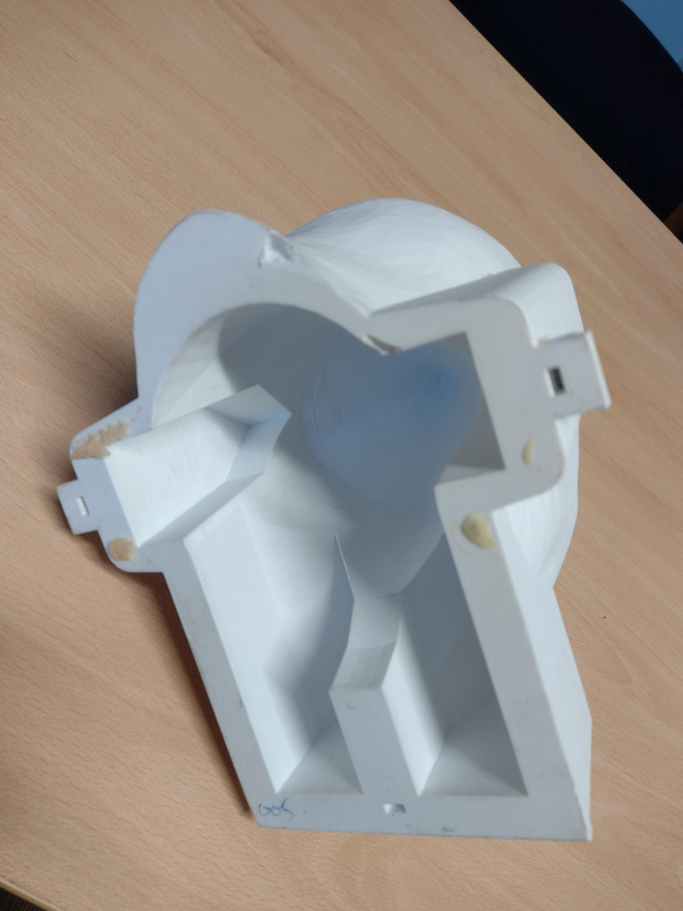
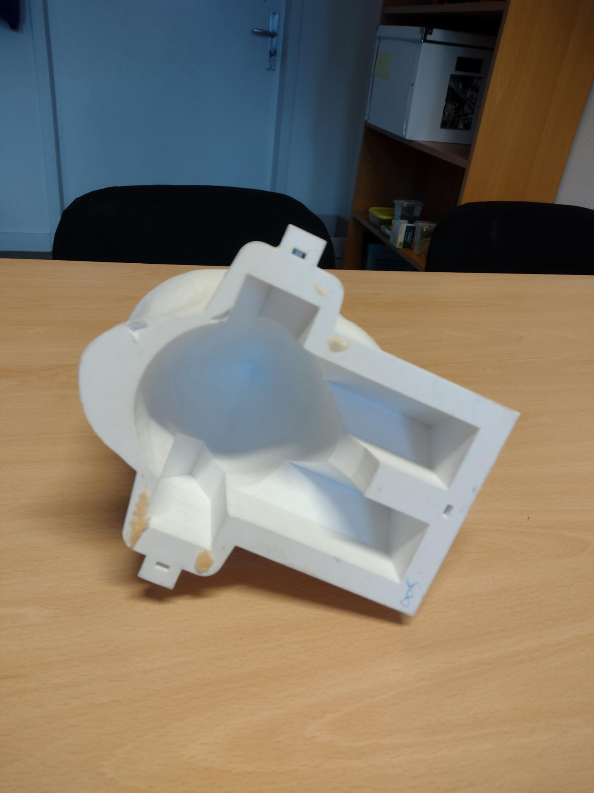
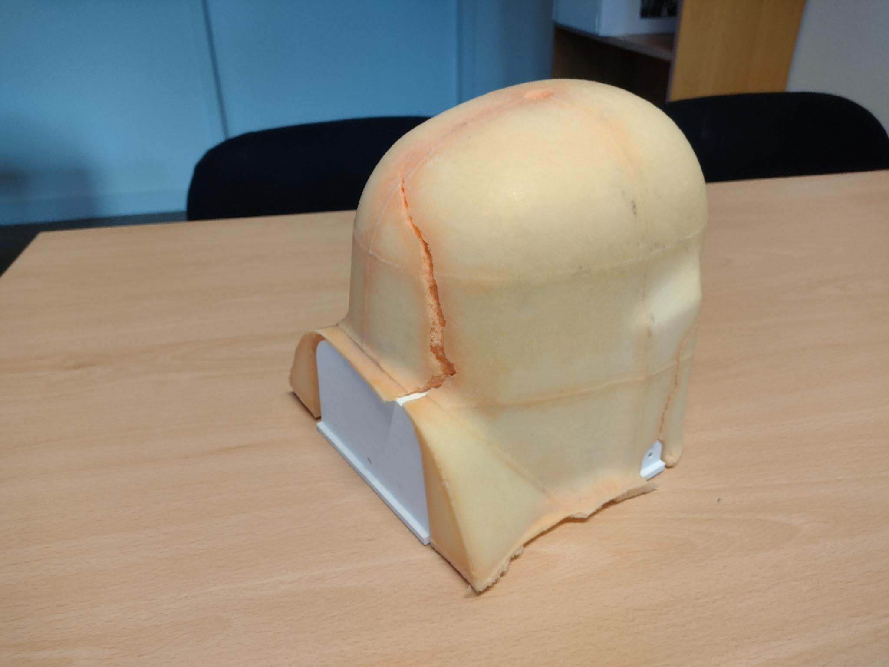
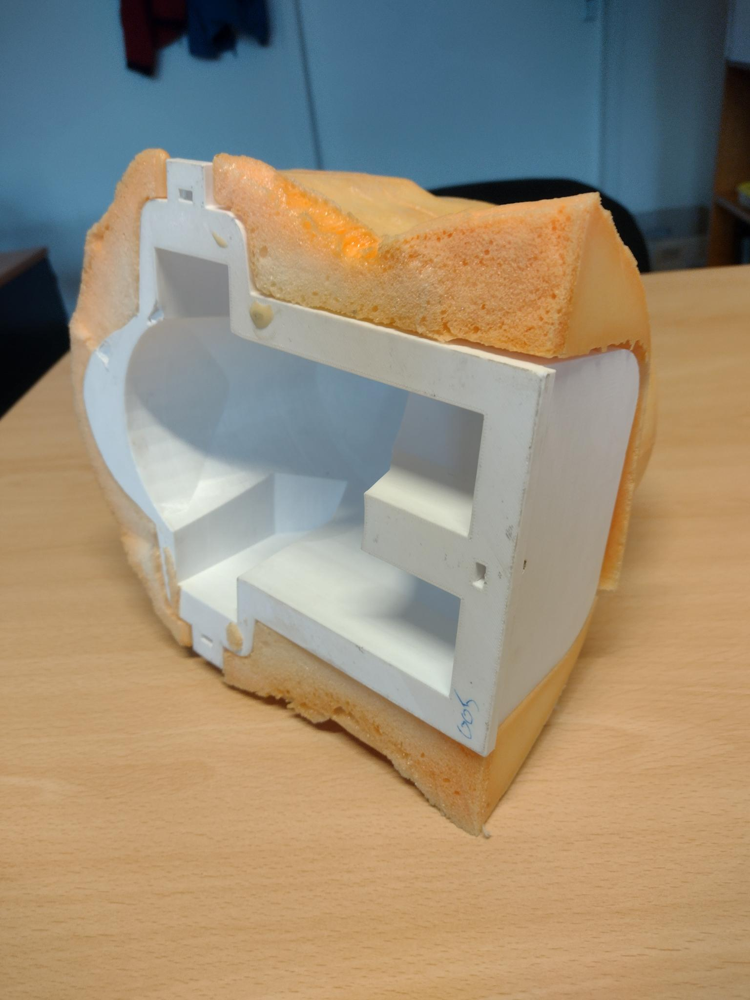
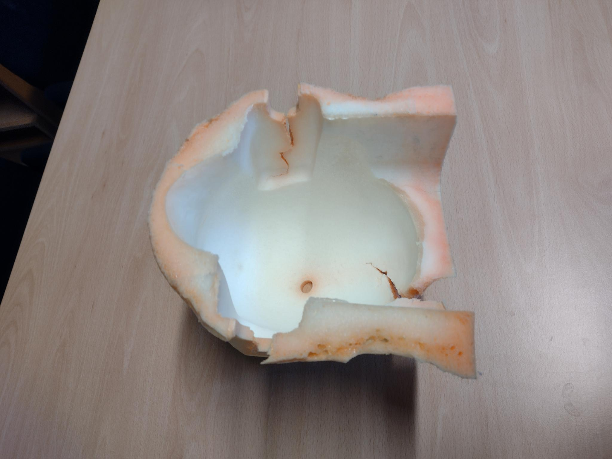
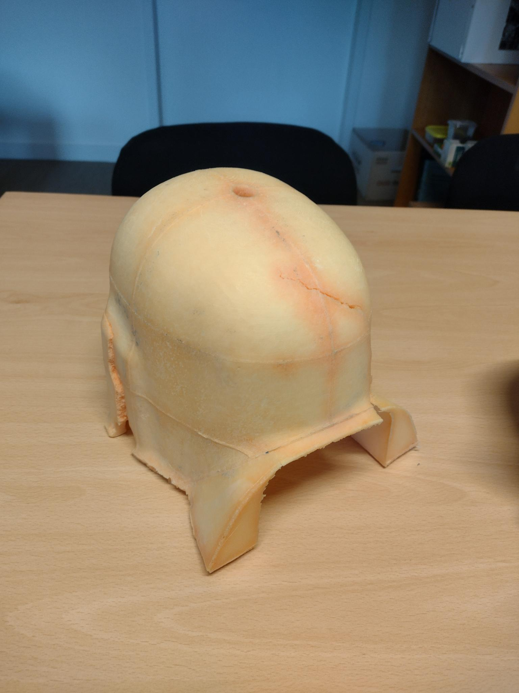
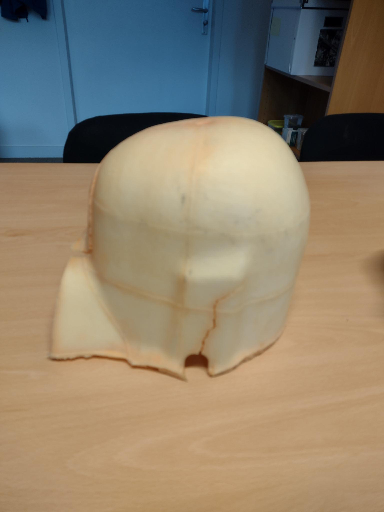

# Designing a MEG headcast - iteration 3

This is the 3rd iteration of the process to design and construct individualized headcasts for the CTF MEG system.

We start by making a computer model of the head surface that is aligned properly with the MEG helmet (which is also called the dewar).

First follow the [procedure](./procedure.m) in MATLAB using FieldTrip:

- importing the MRI (as DICOM or NIFTI)
- segmenting the head surface with ft_volumesegment
- positioning the head surface in the dewar using ft_interactiverealign
- exporting the aligned head surface

Then in MeshLab, as explained in this [YouTube video](https://www.youtube.com/watch?v=7c7nLuYW4Ns):

- read in the headshape, neckslab, noseslab, headcore and moldcore STL files.
- subtract the noseslab from the headshape, this removes the tip of the nose (not always needed, but it cannot hurt)
- subtract the neckslab from the headshape, this removes everything below the dewar
- combine the headshape and headcore
- subtract the moldcore from the combined headshape+headcore
- export the resulting mesh as the final STL file to be printed

Printing can be done on any 3D printer with a sufficiently large build volume, but our experience so far has been with a Prusa i3 Mk3 printer and the following settings:

- 0.20 layer height, speed
- Devil Design PETG
- Fill 15%
- No support (*)
- The infill pattern can be 'adaptive cubic' to save, but a regular pattern is also fine.
- 2 or 3 perimeters. More perimeters makes the print stronger, but also increases print time.

(*) If support is needed in the back of the neck, it is recommended  to use organic ssupport, at least if it fits on the base plate. Otherwise, regular support blocks can be used to limit support only to the desired area's.

Pouring of the foam between the 3D printed head model and the piecewise 3D printed model of the dewar is done using the existing procedure, where both the head model and the inside of the dewar model need to be treated with wax to prevent them from sticking to the foam.
